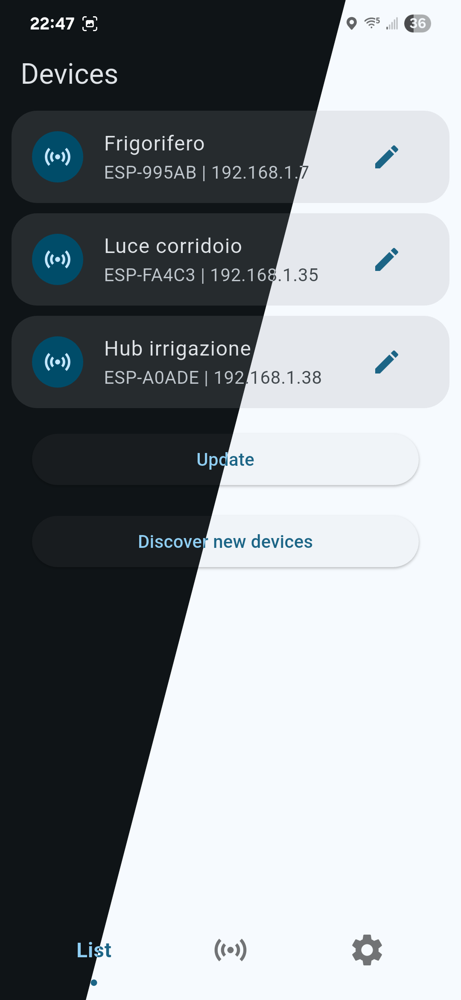
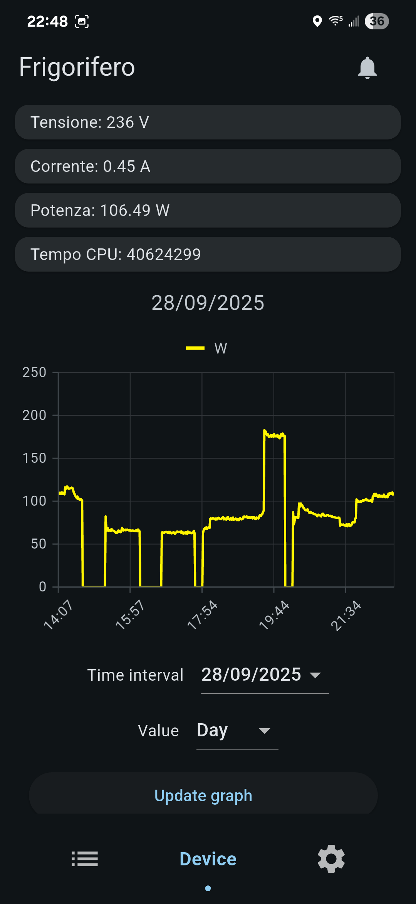
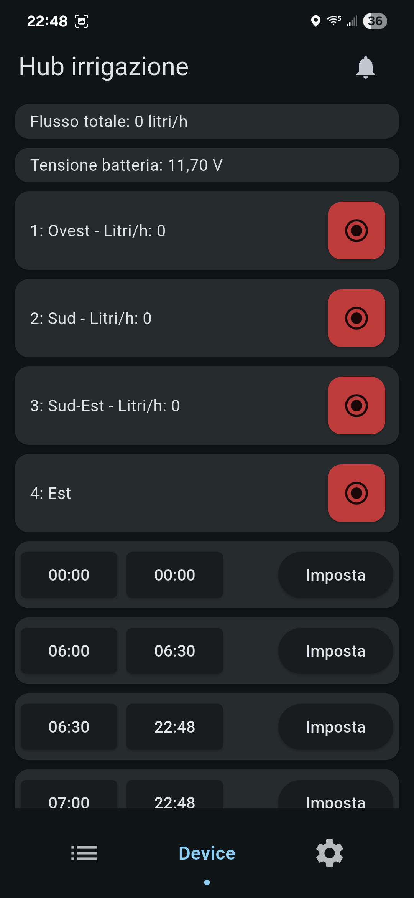
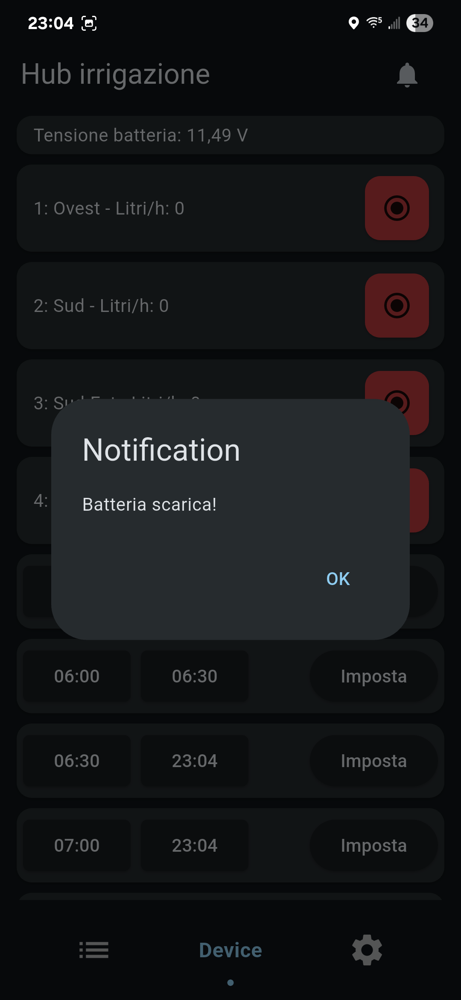
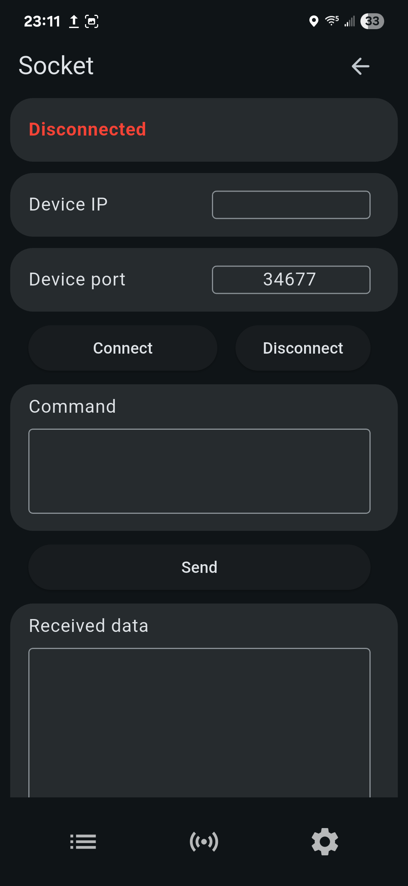
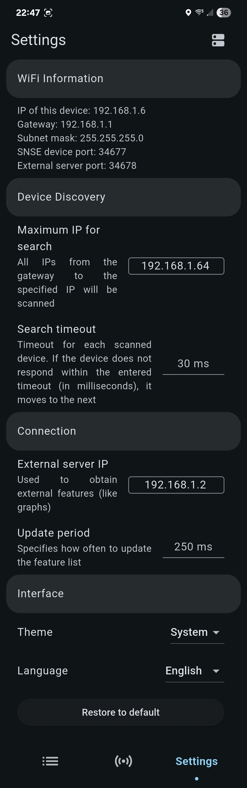

# SNSE
### Easily create your own IoT device and control it from an Android app

## Features
Supports **dark/light mode**, **graphs**, **buttons**, in-app **notifications**.
### Direct socket communication
You can access this page from the settings. It's used for debug purposes: you can connect to a SNSE socket and send/receive data
### Settings
There are multiple settings to adapt to your use case. You can change the number of devicees searched, the update interval, the external server IP or the search timeout. Currently, the supported languages are: Italian, English, Spanish, French, German



# How it works
## STM32-ESP board
The main component is the STM32 - ESP8266 board. The STM32 communicates via UART with the ESP8266, which as the AT firmware loaded. When the microcontroller boots, it resets the ESP, initializes the UART DMA, connects to the specified WiFi (`credentials.h`) and sets up a server with the port `34677`. In the main loop it checks for new connections and handles them. My **ESP-AT-STM32** driver makes it very easy to add new features: you can just check if the request has a certain key and/or value with simple functions. You can check the driver page [here](https://github.com/Kikkiu17/ESP-AT-STM32) to see an example. The same example code is in [this project's STM32 folder](https://github.com/Kikkiu17/SNSE/tree/main/STM32).
## External server
If you need more complex features, such as a graph, an [external server](https://github.com/Kikkiu17/SNSE/tree/main/SNSE%20external%20server) is needed. It gets devices IPs from the `devs_list.txt` file and for every line, it connects to the IP and gets the specified number of features. For example, if a device sends the following data as features: `09/09/2025;17:51;0 V;0.00 A;0.00 W;`, and a line in `devs_list.txt` is `192.168.1.7 3`, it gets `0 V`, `0.00 A`, `0.00 W` and saves them in a file in the folder `devs`. This data can then be used to display a graph in the SNSE app.
## App
You can get the latest app apk from the [releases page](https://github.com/Kikkiu17/SNSE/releases/latest). It scans the network for devices with an open `34677` port, gets their name, IP, features, and adds them in the app. When you open the device page, it connects to the device and queries its features every 250ms (default interval) and displays them.

# Setup
## STM32 board
- A board with an STM32 and an ESP8266 (or ESP32, it just needs to have Espressif's AT firmware loaded) is needed. These two must be connected via UART
- **UART RX DMA** has to be set up on the STM32 in **circular mode** to receive incoming data from the ESP
- *(If you're using STM32CubeIDE)* Tick the box next to "**Generate peripheral initialization as a pair of '.c/.h' files per peripheral**" in your project's .ioc file
- It is recommended for the STM32 to have *at least* 32KB of FLASH memory and 8KB of RAM.

Please use the code provided in the [STM32 folder](https://github.com/Kikkiu17/SNSE/tree/main/STM32) to set up your SNSE project. The example uses an STM32G030F6P6. If you have the same microcontroller, everything is already set up. If not, copy the folders 
- `ESP8266`,
- `Flash`,
- `wifihandler`,

and the files
- `settings.h`,
- `credentials.h`,
- `main.c` (in the Src folder)

to your project. 

Next, change the settings in the `settings.h` file. If you want to save data to the flash memory, remember to check the last page address in the FLASH section of the file! <ins>If the program binary size is greater than FLASH_SIZE - PAGE_SIZE</ins>, where FLASH_SIZE is the size of your microcontroller's flash and PAGE_SIZE is the size of your microcontroller's flash page, <ins>the program WILL be overwritten and undefined behavior may occur.</ins> Check your datasheet!

Now, you can upload the example to your microcontroller. If you open the Android app, it will automatically search for new devices and will find the one you just set up.
## External server
To set up the external server, you need to compile the two `.cpp` files in the [external server folder](https://github.com/Kikkiu17/SNSE/tree/main/SNSE%20external%20server) (for example by running `gcc -o snse_server snse_comm_server.cpp` and `gcc -o snse_getter snse_getter.cpp`).

Open the `devs_list.txt` file and for every line write the IP of the device you want to log the data from, followed by a whitespace and a number, which specifies the number of sensors to log.

For example, if a device sends the following features: `09/09/2025;17:51;0 V;0.00 A;0.00 W;`, it will log `0 V`, `0.00 A`, `0.00 W` and the timestamp, to be used for external features.
## Add a feature
To add a feature you have to update the **comm template** in `settings.h` (specifically the *FEATURES_TEMPLATE* constant). Every feature has to be in its own line and needs a semicolon (;) at the end, enclosed by quotation marks ("). To add a simple sensor feature, add a new line like this:
- "sensor1$Voltage$%d V;"

Now we have to specify the voltage variable that will be printed in the feature. To do this, open `STM32/Core/wifihandler/wifihandler.c` and go to the `WIFIHANDLER_HandleFeaturePacket` function. Add a line in the `sprintf` function call to include your variable, for example:
```
sprintf(conn->wifi->buf, features_template,
  voltage_variable
);
```
As you can see, adding every feature in its own line in the FEATURES_TEMPLATE is useful so that we can easily distinguish the variables in this function. If `voltage_variable` is 230, this new feature will be displayed in the Android app as following:
- Voltage: 230 V

Now you can add any supported feature. All the features and their usage are documented in the `settings.h` file. For other examples, you can check some of my other projects based on SNSE: [AutoIrrigator](https://github.com/Kikkiu17/AutoIrrigator), [AutoLight](https://github.com/Kikkiu17/AutoLight), [ESPIOT](https://github.com/Kikkiu17/espiot). The example provided in this repository has a sensor feature and a switch feature.
